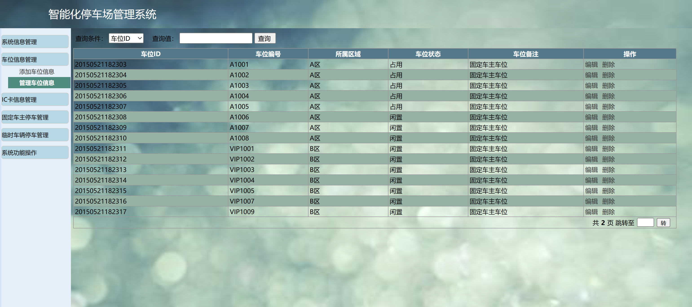
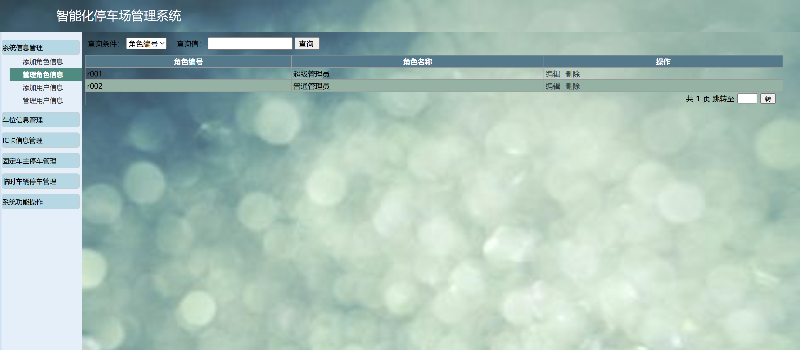
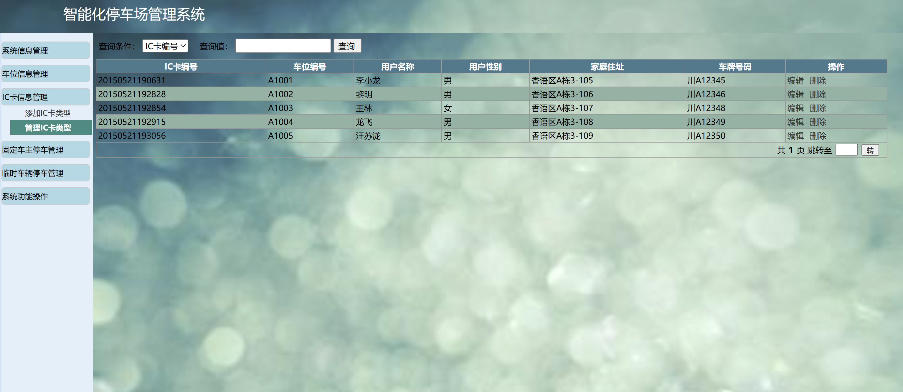
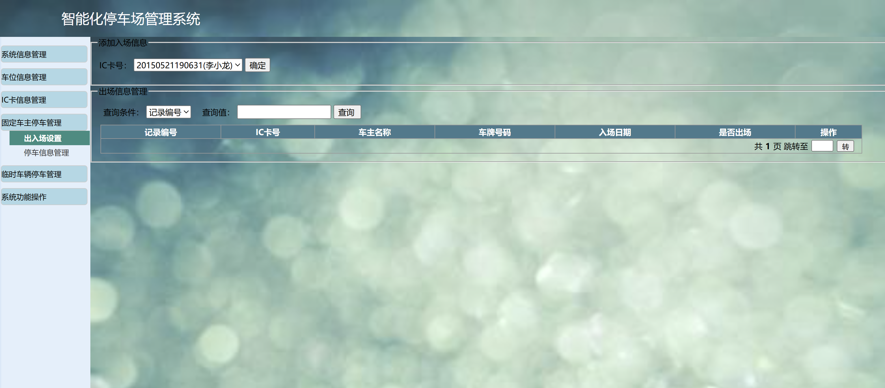
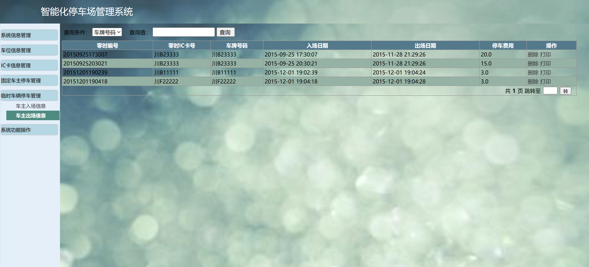

# jspServlet010
jspServlet010停车场管理系统+BG
 
## 查看主页获取源码

### 一、关键词
停车场管理系统，停车场系统

### 二、作品包含
源码+数据库+设计报告文档+PPT+全套环境和工具资源+本地部署教程

### 三、项目技术
前端技术：Html、Css、Js、Jquery
后端技术：Java、JSP、Servlet、JDBC

### 四、运行环境（以下版本亲测，其他版本兼容性请自行测试）
开发工具：IDEA/eclipse

数据库：MySQL5.7或8.0

服务器：Tomcat8.5或Tomcat9.0

数据库管理工具：Navicat10以上版本

环境配置软件： JDK1.8

浏览器：谷歌浏览器

### 五、项目介绍
项目编号：jspServlet010

随着现代社会的快速发展，人民生活水平快速提高，汽车的数量飞速增加，在生活小区、办公场所、商场、景点等地方，停车难问题也日益突出。为了解决停车难的问题，结合一些当前的停车场模式和现状开发出本停车场管理系统。

主要功能包括场内车辆管理和后台数据库管理，其中场内车辆管理又分为车位管理模块、收费管理模块、停车场数据管理模块、系统功能操作模块、用户信息管理模块等。我们从系统的功能实现和设计方面阐述了管理系统软件的开发过程。

### 六、运行截图

